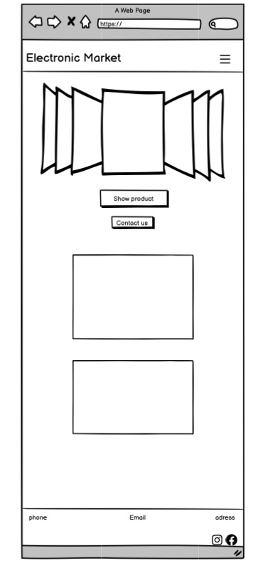
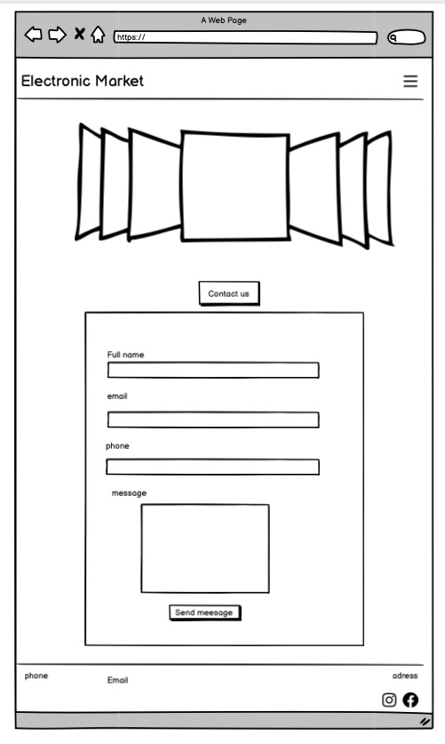
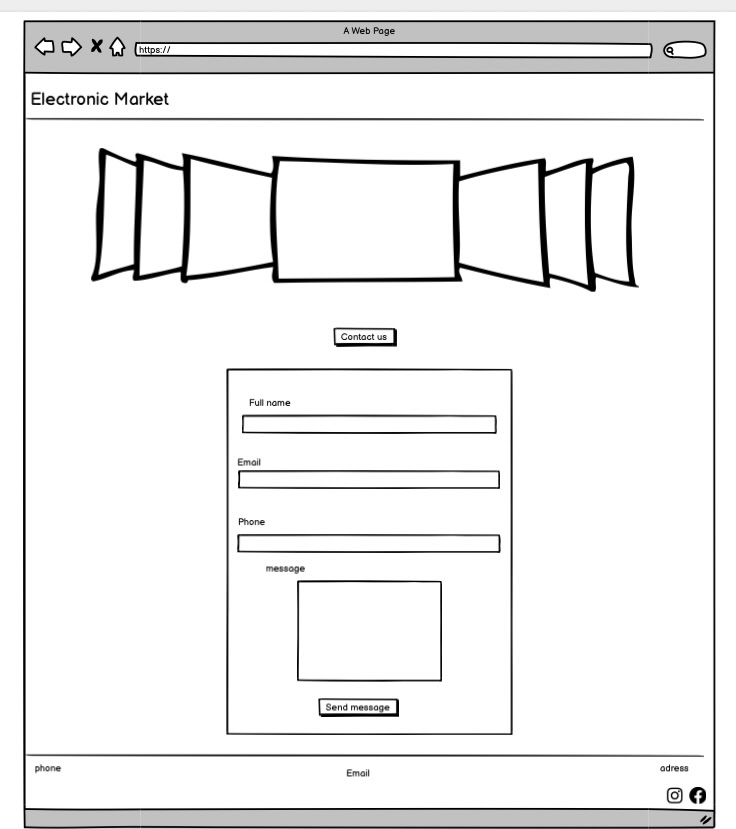
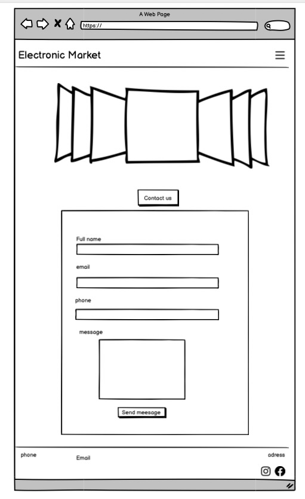
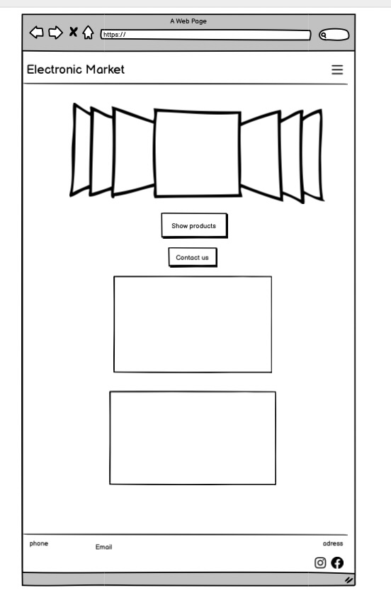
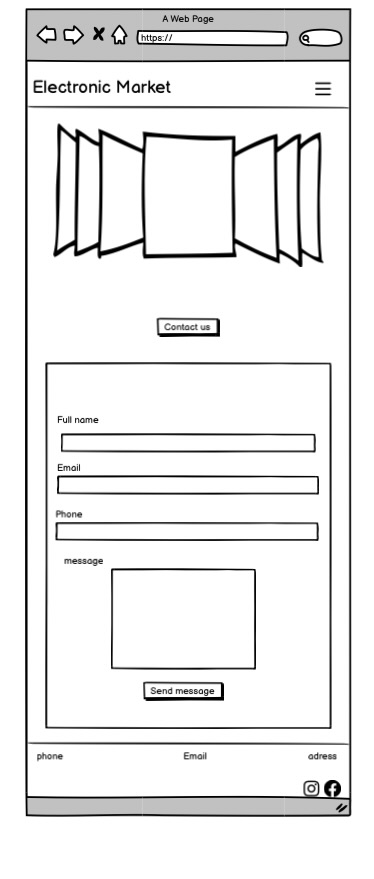
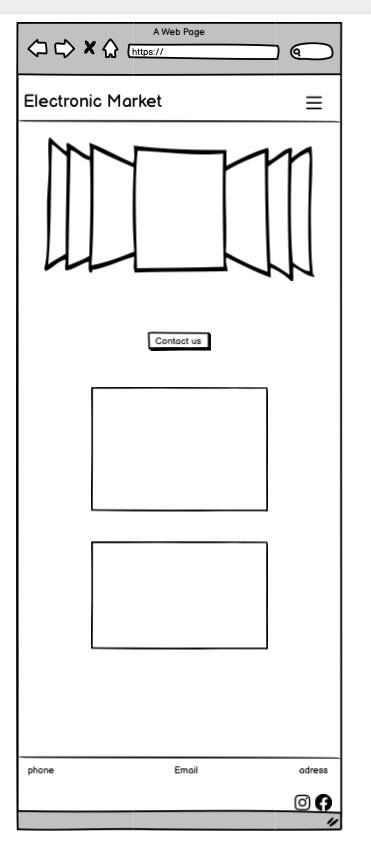
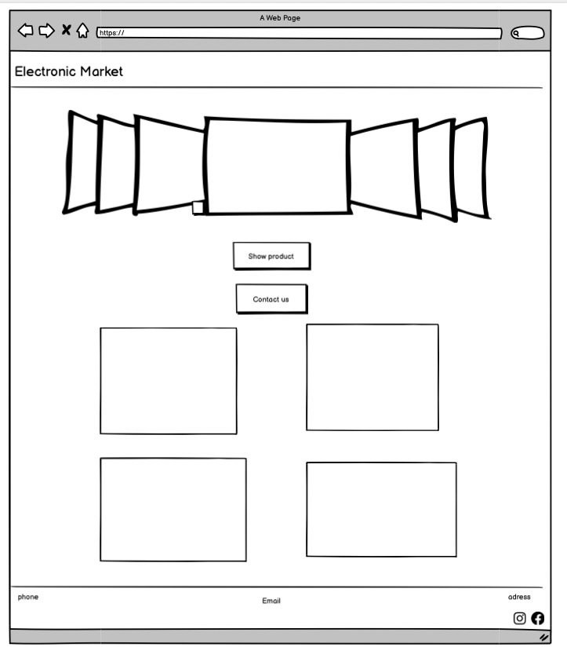
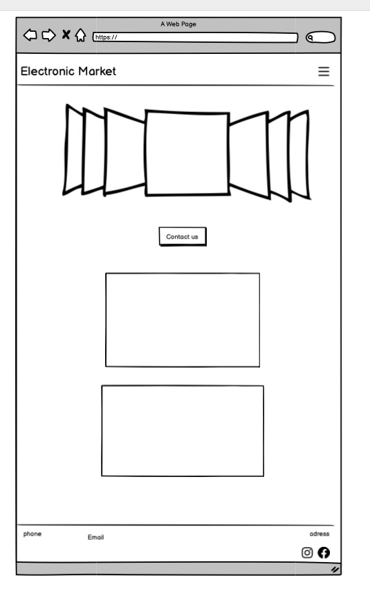
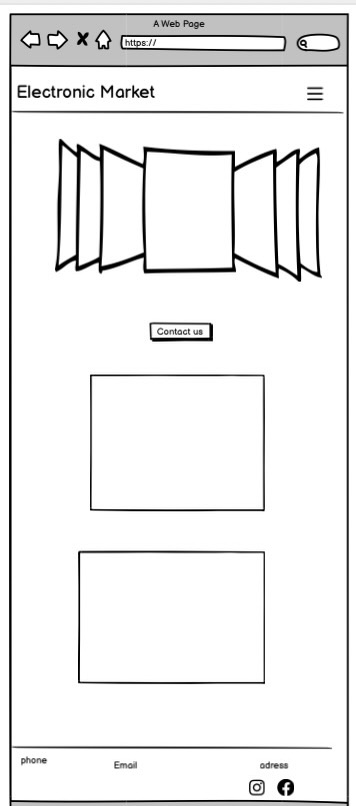

# Electronic-product-showcase
Electronic Market is a responsive front-end website designed to showcase and sell electronic products such as mobiles and laptops. 

The website allows users to browse products view items using a carousel and contact the market through the contact form/section or the social media links so the customer is able to click on icons.

Electronic Market is targeted at users who want to explore, compare, and purchase electronic products online in a simple and intuitive interface.
The website is fully responsive, designed to provide an optimal experience on desktop, tablet, and mobile devices.
I built the project as part of a milestone assessment to demonstrate skills in HTML, CSS and using Bootstrap as optional library, i focused on clean UI, responsiveness, and user experience. 

## Home Page 
- desktop

- Tablet

- Mobile
!|[Home,mobile](images/Screenshot%202026-02-13%20at%2012.33.02.png)

* The Home Page introduces users to Electronic Market with a clear hero section and featured product carousel. 
It provides an overview of the core purpose of the site, allowing users to navigate easily and see highlighted products.

## Products Page
- Desktop 

- Tablet 

- Mobile 

Each product card highlights the main features and price clearly, making it easy for users to make purchasing decisions.

### Contact Page
- Desktop 

- Tablet 

- Mobile 

The form is fully functional and responsive. Social media icons open links in new tabs, ensuring easy navigation for users.

## Features Section
- Navigations bar
1. Featured on all pages, the full responsive navigation bar includes links to Home, Products, and Contact pages.
2. This allows users to easily navigate the site across all devices without confusion.

- Home Page and Carousel
1. The homepage includes a hero section and product carousel to showcase featured electronics.
2. Provides a clear introduction and easy access to product highlights.

- product Page 
1. Lists products with images and prices.

- Contact Page 
1. Includes a simple form: Name, Email, Message and Social media links.

- Social Media Footer
1. Footer includes links to social media platforms.
2. Encourages users to connect with the market online and follow updates.
and all the description you can check it in the images 

# Deployment 
 This section describes the process followed to deploy the project to a hosting platform(GitHUb Pages)
 The site was deployed to GitHub Pages. The steps to deploy are as follows:
 1. Navigate to your GitHub repository: Electronic-product-showcase 
 2. Click on the Setting tab.
 3. Scroll down to the Pages section.
 4. Under "Source", select the main branch.
 5. Click Save. the page will refresh automatically, and a ribbon will appear to indicate the deployment was successful.
 the live site can be accessed here.
[Electronic Market](https://darksyntax99.github.io/Electronic-product-showcase/)

# Manual Testing 

| Feature            | Test                                      | Expected Result             | Actual Result                    |
| ------------------ | ----------------------------------------- | --------------------------- | -------------------------------- |
| Navbar             | Click Home, Products, Contact links       | Navigate to correct page    | Works as expected                |
| Carousel           | Click next/prev buttons                   | Images slide correctly      | Works as expected                |
| Contact Form       | Enter Name, Email, Message and submit     | Form submits without errors | Works as expected (page reloads) |
| Social Media Icons | Click Facebook/Instagram                  | Open link in new tab        | Works as expected                |
| Responsive Layout  | Resize screen (Desktop / Tablet / Mobile) | Layout adjusts correctly    | Works as expected                |

# Browser & Device Testing

1. Desktop (≥1024px) tested on Chrome, Firefox, Safari

2. Tablet (768px) tested on Chrome, Safari 

3. Mobile (≤375px) tested on Chrome, Safari

## Lighthouse (Chrome DevTools)
- Best Practices **100**
- Accessibility **90**
- SEO **91**
- performance **74**

## About the Lighthouse Performance Note 
The performance score is affected by the use of high-resolution images and probably external libraries such as bootstrap and font awesome. Maybe the images optimization and lazy loading could improve performance in iterations.

## Bugs/Errors and Fixes
1. Bug 1- Navbar overlapping 

Issue: The fixed navbar was overlapping the top page content.

Cause: Bootstrap fixed navbar removes the element from normal document flow.

Fix: Added spacing using padding-top /  on the body.

2. Bug 2 — Missing alt attribute on images

Issue: HTML validator returned error for missing alt attributes.
Cause: Some product images were missing alt text.
Fix: Added descriptive alt attributes to all img elements.

3. bug 3- Heading structure error 

Issue: Validator warning about skipping heading levels (h2 → h5).

Cuase: Product titles used h5 without intermediate heading structure.

Fix: Adjusted heading hierarchy to follow logical order or ensured correct section structure.

4. Bug 4 — Stray closing div
Issue: Validator error: stray end tag div.

Cause: Extra closing div after hero section.

Fix: Removed the unnecessary closing div.

5. Bug 5 — Hero section spacing not applied

Issue: Hero section padding and margins were not showing as designed.

Cause: Bootstrap utility classes were overriding the hero section spacing.

Fix: Added !important to padding and margin properties to ensure the hero section layout appears correctly.

6. Bug 6 — Form input styling not working

Issue: Custom background color and text color for form inputs were not applied.

Cause: Bootstrap .form-control default styles were overriding custom styles.

Fix: Used !important to override Bootstrap input styling and enforce the custom theme colors.

## HTML Validators
All HTML, CSS passed without any errors

[Test,indexHTML](https://validator.w3.org/nu/?doc=https%3A%2F%2Fdarksyntax99.github.io%2FElectronic-product-showcase%2Findex.html)

[Test,productHTML](https://validator.w3.org/nu/?doc=https%3A%2F%2Fdarksyntax99.github.io%2FElectronic-product-showcase%2Fproduct.html)

[test,contactHTML](https://validator.w3.org/nu/?doc=https%3A%2F%2Fdarksyntax99.github.io%2FElectronic-product-showcase%2Fcontact.html)

[Test,CSS](https://jigsaw.w3.org/css-validator/validator)

# Built by
- HTML5
- CSS3
## Library
- Bootstrap v5.3.8
## Fonts
- Google Fonts 
## Icons 
- Fonts Awesome

# User Experience (UX)
## User Story 1: View electronic products 
- As a user i want to clearly view the products 
features so that i can understand what the product offers.
# Acceptance Criteria
- I need a clear and concise description of the electronic products.
- I'd like to list the most important features as bullet points, not as a long text.
- I don't need to scroll much to find out the basic information.

## User Story 2: View Images 
- As a user i want to see high-quality images of the product so that I can know how it looks from different angles.
# Acceptance Criteria
- I see a clear main image of the product.
- I see more than one image (from different angles).
- Images are of appropriate quality.

## User Story 3: Easy to navigate 
- As a user i want simple and clear navigation  so that I can move easily between the website pages.
# Acceptance Criteria
- Text and images change according to screen size.
- The navigation menu becomes a drop-down menu on the phone.
- There is no horizontal scrolling

## User Story 4: devise compatibility 
- As a user i want the website to be responsive that I can view it comfortably on mobile, tablet, and desktop.
# Acceptance Criteria
- Having a table or detailed list of specification.
- The information is organized, such as: weight battery and connection.
- The format is easy to read.

## User Story 5: Price details
-  As a user i want to see pricing so that I can decide whether to buy the product.
# Acceptance Criteria
- The price is obvious and needs no further explanation.
- Appears on the product page.
- It appears in an attractive visual style (card or box shape).

## User Story 6: Contact
- As a user i want to access a contact form so that I can ask questions or request more information about the product. 
# Acceptance Criteria
- The Contact page is working.
- It has a simple form: Name-Email-Message.
- I can send a message 

## Wireframes 
Wireframes were created during the planning stage to define the basic structure and layout of the website across different screen sizes. Each page was designed with a mobile-first approach and adapted for desktop and tablet screens.

### Homepage Wireframes

*Desktop Homepage Layout*

*Mobile Homepage Layout*

*Homepage Alternative Layout*

### Products Page Wireframes

### Contact Page Wireframes

### Additional Design Wireframes

## ABOUT THE AI (github copilot)
I used AI during the development of this 
project strictly as a learning tools.
- Understanding responsiveness issues and layout behavior.
- improve understanding of lighthouse.
All code in this project was written, adapted, and fully understood by me.
No AI-generated code was copied directly into the project.
AI was only consulted in specific situations to help identify issues (for example understanding when and why !important might be necessary) after which I implemented the solutions myself
I remain fully responsible for the project’s structure code decisions and final implementation.

